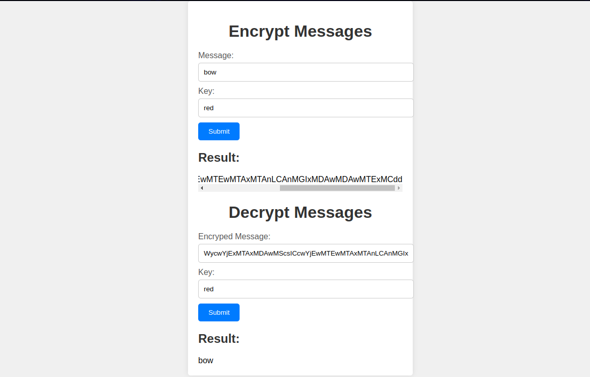

# Symmetric Algorithm API

## To start in development mode
1. Create python env: `python -m venv env`
2. Activate env: `source env/bin/activate`
3. Install dependencies: `pip install -r requirements.txt`
4. Run API: `uvicorn src.main:app --reload`
5. Go to `http://127.0.0.1:8000/docs` to see the documentation on swagger.

## Interface: 

